# Voxelized Game Engine and 3D Object Voxelizer

<a href="https://navigator.glre.dev">
  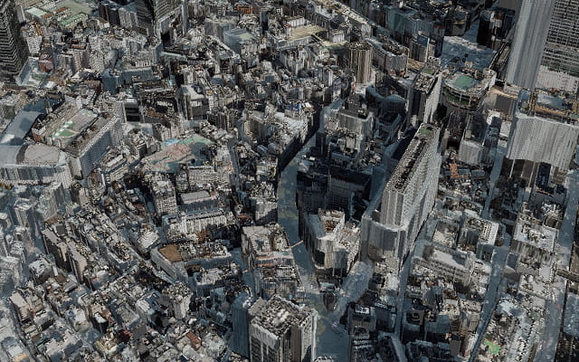
</a>

<details>
<summary>

### demo: glre.dev

- **Voxel Technology**: World's most popular game rendering technique
- **TypeScript/Rust/GLRE**: Browser execution with high-performance computing
- **WebAssembly/WebGL/WebGPU**: Cross-platform 3D processing foundation

This project provides both a voxelized game engine and a 3D object voxelizer. The voxelizer converts 3D models into efficient voxel representations, while the game engine enables real-time rendering of large-scale voxelized worlds in web browsers. Both components are optimized for web deployment with minimal dependencies.

</summary>

- **ボクセル技術**: 世界で最も人気なゲームで使用されている描画手法
- **TypeScript/Rust/GLRE**: ブラウザ実行と高性能計算の両立
- **WebAssembly/WebGL/WebGPU**: クロスプラットフォーム 3D 処理基盤

このプロジェクトはボクセル化ゲームエンジンと 3D オブジェクトボクセライザーの両方を提供します。ボクセライザーは 3D モデルを効率的なボクセル表現に変換し、ゲームエンジンは Web ブラウザ上で大規模なボクセル化された世界をリアルタイム描画可能にします。両コンポーネントは最小限の依存関係で Web 展開に最適化されています。

</details>

###### Install

```ts
npm install voxelizer-js
```

##### Repogitory

```rb
github.com/tseijp/voxelizer
```

###### Homepage

```rb
voxelizer.tsei.jp
```

---

<details>
<summary>

### Eliminating development barriers through library-based distribution

| Current Content Issues (as-is) |     | Improvement Points (to-be) |
| :----------------------------- | :-- | :------------------------- |
| Unity-dependent libraries      |     | Library distribution       |
| ・Complex environment setup    |     | ・npm install only         |
| ・Proprietary systems          |     | ・Open source              |
| ・Difficult web deployment     |     | ・Direct browser execution |
| Proprietary data formats       |     | Standard data formats      |
| ・Unity-specific assets        |     | ・Image data               |
| ・Binary formats               |     | ・CDN delivery support     |
| ・Required conversion tools    |     | ・Cache efficiency         |

Traditional 3D model distribution requires complex Unity SDKs and proprietary formats that are unsuitable for web deployment. This project eliminates these barriers by providing npm-distributed libraries that work directly in browsers. Data is distributed as standard PNG images optimized for CDN delivery and browser caching, enabling immediate deployment without specialized tools or environments.

</summary>

**Web 標準技術によるライブラリ化で開発障壁を除去**

| 現状のコンテンツの課題 （as-is） |     | 改修ポイント （to-be） |
| :------------------------------- | :-- | :--------------------- |
| Unity 前提のライブラリ           |     | ライブラリとして配布   |
| ・複雑な環境構築                 |     | ・npm install のみ     |
| ・プロプライエタリ               |     | ・オープンソース       |
| ・Web 対応が困難                 |     | ・ブラウザ直接実行     |
| 専用データ形式                   |     | 標準データ形式         |
| ・Unity 専用アセット             |     | ・画像データ           |
| ・バイナリ形式                   |     | ・CDN 配信対応         |
| ・変換ツール必須                 |     | ・キャッシュ効率       |

従来の 3D モデル配布では複雑な Unity SDK と専用形式が必要で Web デプロイに不適切でした。このプロジェクトは、ブラウザで直接動作する npm 配布ライブラリによりこれらの障壁を除去します。データは標準 PNG 画像として配布され、CDN 配信とブラウザキャッシュに最適化され、専門ツールや環境なしで即座にデプロイできます。

</details>

---

<details>
<summary>

### Integrating three different coordinate systems based on image pixels, eliminating coordinate transformation complexity

The coordinate system transformation problem involves handling three distinct spatial reference systems: PLATEAU coordinate system (EPSG:6677 - JGD2011), Web Mercator tile system, and WebGL world space. Each system has different units, origins, and axis orientations, making accurate transformation extremely complex. This project solves this by standardizing all coordinates to image pixel coordinates where 1 pixel = 1 meter = 1 block, enabling direct spatial correlation without complex mathematical transformations.

</summary>

**3 つの異なる座標系を画像ピクセル基準に統合し、座標変換の複雑性を排除**

座標系変換問題は、PLATEAU 座標系（EPSG:6677 - JGD2011）、Web メルカトルタイルシステム、WebGL ワールド空間という 3 つの異なる空間参照系を扱うことを含みます。各システムは異なる単位、原点、軸の向きを持ち、正確な変換を極めて複雑にします。このプロジェクトは、1 ピクセル=1 メートル=1 ブロックという画像ピクセル座標にすべての座標を標準化することでこれを解決し、複雑な数学的変換なしで直接的な空間相関を可能にします。

</details>

---

<details>
<summary>

### Converting from complex triangle-based data to 0/1 arrays for computational optimization

| 3D Model (as-is)               |     | Voxel Data Structure (to-be) |
| :----------------------------- | :-- | :--------------------------- |
| .obj + .mtl + images           |     | 3-dimensional 0/1 array      |
| Triangle mesh:                 |     | 1 block = 0 or 1:            |
| ・Collision detection: O(n³)   |     | ・Collision detection: O(1)  |
| ・All triangles examined       |     | ・Direct coordinate checking |
| ・AABB optimization needed     |     | ・Integer calculation only   |
| Rendering:                     |     | Rendering:                   |
| ・Tens of thousands draw calls |     | ・Single draw call           |
| ・Complex material management  |     | ・Bit operation optimization |

Traditional 3D models distribute as complex triangle meshes requiring sophisticated collision detection algorithms and multiple material management systems. The voxel approach converts this to simple 3D binary arrays where spatial queries become constant-time operations and rendering consolidates to single draw calls, dramatically reducing computational overhead and implementation complexity.

</summary>

**三角形ベースの複雑なデータから 0/1 配列への転換により、演算を最適化**

| 3D モデル （as-is）     |     | ボクセルデータ構造 （to-be） |
| :---------------------- | :-- | :--------------------------- |
| .obj + .mtl + 画像      |     | 3 次元の 0/1 配列            |
| 三角形の集合:           |     | 1 ブロック = 0 or 1:         |
| ・衝突判定: O(n³)       |     | ・衝突判定: O(1)             |
| ・全三角形を検査        |     | ・座標から直接判定           |
| ・AABB 等で最適化が必要 |     | ・整数計算のみ               |
| レンダリング:           |     | レンダリング:                |
| ・数万回の draw call    |     | ・1 回の draw call           |
| ・複雑な material 管理  |     | ・ビット演算で最適化可能     |

従来の 3D モデルは複雑な三角形メッシュとして配布され、洗練された衝突検出アルゴリズムと複数のマテリアル管理システムが必要でした。ボクセル手法はこれを単純な 3 次元バイナリ配列に変換し、空間クエリが定数時間操作になり、レンダリングが単一の draw call に統合され、計算オーバーヘッドと実装複雑性を劇的に削減します。

</details>

---

<details>
<summary>

### Consolidating tens of thousands of draw calls into one, achieving 120fps rendering

| Too heavy to run in browser (as-is)               |     | Bit operations possible! Single draw call (to-be) |
| :------------------------------------------------ | :-- | :------------------------------------------------ |
| Tens to hundreds MB 3D models → 0fps              |     | Optimized processing → 120fps                     |
| Multiple materials → tens of thousands draw calls |     | Unified material → single draw call               |
| Multiple textures → excessive CPU/GPU transfer    |     | Single texture → minimal data transfer            |
| Complex geometry → memory shortage                |     | Bit operations → instanced rendering              |

Distributed 3D models typically require thousands of individual draw calls for different materials and textures, causing browsers to fail rendering large-scale urban data (36,872 draw calls observed). This voxelizer eliminates the problem by unifying all materials into single-texture atlases and using instanced rendering techniques, reducing draw calls from thousands to one while maintaining visual fidelity at 120fps performance.

</summary>

**数万回の draw call を 1 回に集約、120fps 描画を実現**

| 重すぎてブラウザで動作不可 （as-is） |     | ビット演算可能！1 回の draw call （to-be） |
| :----------------------------------- | :-- | :----------------------------------------- |
| 数十～数百 MB の 3D モデル → 0fps    |     | 最適化された処理 → 120fps                  |
| 複数 Material → 数万回の draw call   |     | 統合 Material → 1 回の draw call           |
| 複数 Texture → CPU/GPU 間転送過多    |     | 1 つの Texture → 最小限データ転送          |
| 複雑な形状 → メモリ不足              |     | ビット演算 → インスタンシング描画          |

配布される 3D モデルは通常、異なるマテリアルとテクスチャのために数千の個別 draw call を必要とし、ブラウザが大規模な都市データの描画に失敗する原因となります（36,872 の draw call が観測されました）。このボクセライザーは、すべてのマテリアルを単一テクスチャアトラスに統合し、インスタンスレンダリング技術を使用することで問題を解決し、視覚的忠実性を維持しながら数千の draw call を 1 つに削減し、120fps のパフォーマンスを実現します。

</details>

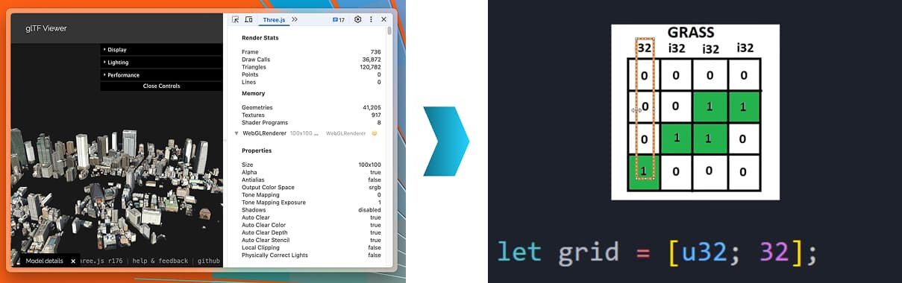

ref: [youtube.com](https://www.youtube.com/watch?v=qnGoGq7DWMc)

---

<details>
<summary>

### Converting from 3D models to image data for partial delivery and cache utilization, enabling fast startup

| Heavy 3D model files (as-is)                 |     | Image data distribution (to-be)                  |
| :------------------------------------------- | :-- | :----------------------------------------------- |
| fbx/obj + mtl + multiple textures            |     | PNG images (256×256×256 voxel → 4096×4096 pixel) |
| ・File size: tens to hundreds MB             |     | ・1 district = 1 image file                      |
| ・Load time: several minutes                 |     | ・Tile division for partial data acquisition     |
| ・Complex asset management                   |     | ・Browser cache utilization                      |
| ・Data reduction needed for rough appearance |     | ・CDN delivery support (Cloudflare R2)           |

This system utilizes PNG format for data distribution and is actively developing advanced compression techniques including sparse voxel directed acyclic graphs (SVDAGs), run-length encoding (RLE) with space-filling curves, and spatial predictive coding methods. These emerging optimization approaches are being implemented to achieve significant image file size reduction while maintaining visual quality.

</summary>

**3D モデルから画像データへの変換により、部分配信とキャッシュ活用で高速起動を実現**

| 重量な 3D モデルファイル（as-is）    |     | 画像データとして配信 （to-be）                   |
| :----------------------------------- | :-- | :----------------------------------------------- |
| fbx/obj + mtl + 複数テクスチャ       |     | PNG 画像 （256×256×256 voxel → 4096×4096 pixel） |
| ・ファイルサイズ: 数十～数百 MB      |     | ・1 区画 = 1 画像ファイル                        |
| ・ロード時間: 数分                   |     | ・タイル分割し部分的データ取得                   |
| ・複雑なアセット管理                 |     | ・ブラウザキャッシュ活用                         |
| ・荒い見た目になるまでデータ削減必要 |     | ・CDN 配信対応 (Cloudflare R2)                   |

このシステムは PNG 形式でのデータ配信を使用し、sparse voxel directed acyclic graphs（SVDAGs）、空間充填曲線を用いた run-length encoding（RLE）、空間予測符号化手法などの高度な圧縮技術の開発を進めています。これらの新しい最適化アプローチは、視覚品質を維持しながら大幅な画像ファイルサイズ削減を実現するために実装中です。

</details>

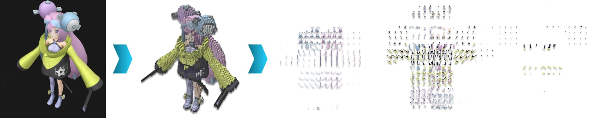

---

<details>
<summary>

### Achieving both maintenance cost reduction and fast startup with minimal dependency-free code

| Common Game Engines (as-is)  |     | Our Solution (to-be)               |
| :--------------------------- | :-- | :--------------------------------- |
| Unity/Three.js/Babylon.js    |     | Minimal dependency-free code       |
| ・Hundreds MB to GB engines  |     | ・No dependencies except WebGL API |
| ・Complex dependencies       |     | ・No update maintenance required   |
| ・Regular update maintenance |     | ・Fast initial rendering           |
| ・High learning cost         |     | ・Minimal management cost          |

Common game engines require hundreds of megabytes to gigabytes of code with complex dependency trees, but this project implements complete functionality with minimal dependency-free code. The engine includes advanced rendering optimizations such as frustum culling, greedy meshing, and instanced rendering. By avoiding external libraries beyond WebGL API, it eliminates update maintenance overhead, reduces technical debt, and enables rapid initial loading for optimal user experience.

</summary>

**最小限の依存なしコードにより、保守コスト削減と高速起動を両立**

| 一般的なゲームエンジン （as-is） |     | 我々のソリューション （to-be） |
| :------------------------------- | :-- | :----------------------------- |
| Unity/Three.js/Babylon.js        |     | 最小限の依存なしコード         |
| ・数百 MB ～数 GB のエンジン     |     | ・WebGL API 以外依存なし       |
| ・複雑な依存関係                 |     | ・アップデート対応不要         |
| ・定期的なアップデート対応       |     | ・高速初期レンダリング         |
| ・高い学習コスト                 |     | ・管理コスト最小化             |

一般的なゲームエンジンは、複雑な依存関係ツリーを持つ数百メガバイトから数ギガバイトのコードを必要としますが、このプロジェクトは最小限の依存関係のないコードで完全な機能を実装します。エンジンにはフラスタムカリング、グリーディメッシング、インスタンスレンダリングなどの高度なレンダリング最適化が含まれています。WebGL API 以外の外部ライブラリを避けることで、アップデートメンテナンスのオーバーヘッドを排除し、技術的負債を削減し、最適なユーザーエクスペリエンスのための高速初期読み込みを可能にします。

</details>

---

<details>
<summary>

### Solving regional limitations of detailed city models through combination with aerial photography for nationwide coverage

| 3D Urban Model Open Data Constraints (as-is)      |     | Our Solution: Aerial Photography Utilization (to-be) |
| :------------------------------------------------ | :-- | :--------------------------------------------------- |
| LOD1 (nationwide coverage)                        |     | Geospatial Information Authority aerial photography  |
| ・No color data                                   |     | ・Nationwide high-resolution imagery                 |
| ・Simple rectangular boxes                        |     | ・Building geometry + aerial photography colors      |
| LOD2 (limited areas)                              |     | ・Color reproduction optimized for aerial view       |
| ・Color data available (limited to station areas) |
| ・Detailed geometry                               |

High-detail 3D models with color information are only available for extremely limited urban areas, while simplified models lack visual appeal. This project provides a technical framework that can combine 3D building geometry with various texture sources including aerial photography for enhanced visual quality. The demo implementation showcases this capability using aerial photography from mapping agencies, demonstrating the potential for rich visual rendering when applied to various urban datasets.

</summary>

**詳細都市モデルの地域制約を航空写真との組み合わせで解決し、全国対応可能**

| 3D 都市モデル Open Data の制約 （as-is） |     | 我々のソリューション: 航空写真活用 （to-be） |
| :--------------------------------------- | :-- | :------------------------------------------- |
| LOD1 （全国対応）                        |     | 国土地理院航空写真                           |
| ・色データなし                           |     | ・全国対応の高解像度画像                     |
| ・単純な直方体                           |     | ・建物形状 + 航空写真色                      |
| LOD2 （限定地域）                        |     | ・上空視点に最適化された色再現               |
| ・色データあり（一部の駅周辺等のみ）     |
| ・詳細な形状                             |

色情報を持つ高詳細 3D モデルは極めて限定された都市部でのみ利用可能で、簡素化されたモデルでは視覚的魅力に欠けます。このプロジェクトは、3D 建物ジオメトリと航空写真を含む様々なテクスチャソースを組み合わせて視覚品質を向上させる技術フレームワークを提供します。デモ実装では測量機関からの航空写真を使用してこの機能を実証し、様々な都市データセットに適用された際のリッチな視覚レンダリングの可能性を示しています。

</details>


---

<details>
<summary>

### Converting aerial photography noise into meaningful shadows through 3D geometry information, achieving high-quality rendering without computational cost

| Aerial Photography Issues (as-is)              |     | Combined Effect with 3D Building Geometry (to-be)      |
| :--------------------------------------------- | :-- | :----------------------------------------------------- |
| Building shadows mixed as noise during capture |     | Building height information clarifies shadow reasoning |
| → Difficult to understand shadow presence      |     | → Shadow reasoning becomes acceptable                  |
| → Disharmonious impression                     |     | → High quality without computational cost              |

Aerial photographs contain shadows cast by buildings at the time of capture, which appear as unexplained visual noise when viewed independently. However, when combined with 3D building geometry, these shadows gain contextual meaning as users understand building heights and recognize shadows as natural consequences of the structures. This eliminates the need for computationally expensive shadow casting algorithms while providing the highest quality realistic shadows.

</summary>

**航空写真のノイズを 3D 形状情報により意味のある影に変換、計算コストなしで高品質描画**

| 航空写真単体の問題 （as-is）     |     | 3D 建物形状との組み合わせ効果 （to-be） |
| :------------------------------- | :-- | :-------------------------------------- |
| 撮影時の建物影がノイズとして混入 |     | 建物の高さ情報により影の理由が明確      |
| → なぜ影があるのか理解困難       |     | → 影の理由が納得できる                  |
| → 不調和な印象                   |     | → 計算コストなしで高品質                |

航空写真には撮影時に建物が落とした影が含まれており、独立して見ると説明のつかない視覚ノイズとして現れます。しかし 3D 建物ジオメトリと組み合わせると、ユーザーが建物の高さを理解し影を構造物の自然な結果として認識するため、これらの影は文脈的意味を得ます。これにより計算負荷の高いシャドウキャスティングアルゴリズムの必要性を排除しながら、最高品質のリアルな影を提供します。

</details>

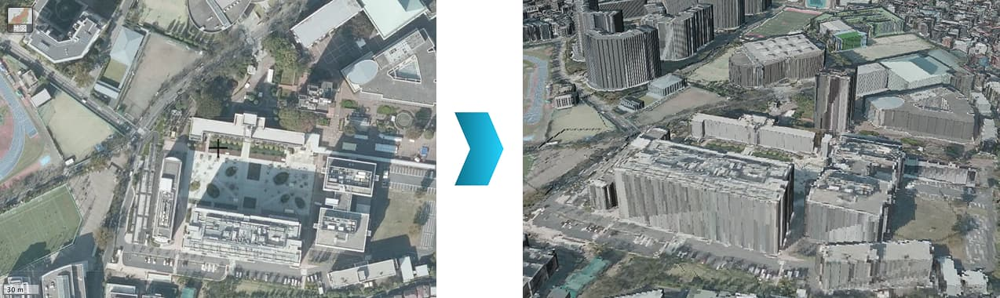

ref: [maps.gsi.go.jp](https://maps.gsi.go.jp/#18/35.662652/139.634084/&base=ort&ls=ort&disp=1&vs=c1g1j0h0k0l0u0t0z0r0s0m0f0)

---

<details>
<summary>

### Providing diverse web experiences utilizing urban data

- **Benefits:**
     - ・Integer coordinates → Precise placement
     - ・O(1) collision detection → Real-time editing
     - ・Unified data structure → Simple implementation
     - ・Network distribution → Multiplayer support
- **Use cases:**
     - ・Urban planning simulation
     - ・Architectural prototyping
     - ・Educational content creation
     - ・Virtual tourism experience

The discrete nature of voxel data makes it ideal for interactive applications where users can modify the environment. Unlike triangle meshes that require complex algorithms for modification, voxel data allows direct manipulation at integer coordinates with immediate visual feedback. This enables applications from educational tools that teach urban geography to collaborative virtual world building experiences.

</summary>

**都市データを活用した多様な Web 体験を提供**

- **利点:**
     - ・整数座標 → 精密な配置
     - ・O(1)衝突判定 → リアルタイム編集
     - ・統一データ構造 → シンプルな実装
     - ・ネットワーク配信 → マルチプレイ対応
- **ユースケース:**
     - ・都市計画シミュレーション
     - ・建築プロトタイピング
     - ・教育コンテンツ作成
     - ・バーチャル観光体験

ボクセルデータの離散的な性質は、ユーザーが環境を変更できるインタラクティブアプリケーションに理想的です。変更に複雑なアルゴリズムを必要とする三角形メッシュとは異なり、ボクセルデータは整数座標での直接操作と即座の視覚フィードバックを可能にします。これにより都市地理を教える教育ツールから協調的なバーチャルワールド構築体験まで、様々なアプリケーションを可能にします。

</details>

## Brush up

### hierarchical pathfinding A-star（`HPA*`）

- service: [navigator.glre.dev](https://navigator.glre.dev)
- require: [navigator.glre.dev/claude/ja](https://navigator.glre.dev/claude/ja)
- proposal: [navigator.glre.dev/readme/ja](https://navigator.glre.dev/readme/ja)
- schedule: [docs.google.com/spreadsheets](https://docs.google.com/spreadsheets/d/1HLuEUU5CTvMhOYZFNg4IE8dtlqicwMc-EzXwbWefWcU)
- slide: [plateau.glre.dev](https://plateau.glre.dev/)

<a href="https://navigator.glre.dev">
  
</a>
<a href="https://navigator.glre.dev">
  
</a>

### morton curve space filling （z-order）

<table>
  <tr>
    <td>
      <h4>hilbert curve</h4>
      <hr>
      demo:
      <a href="https://glre.dev/space/hilbert2d">hilbert2d</a>
      /
      <a href="https://glre.dev/space/hilbert3d">hilbert3d</a>
      <a href="https://glre.dev/space/hilbert2d">
        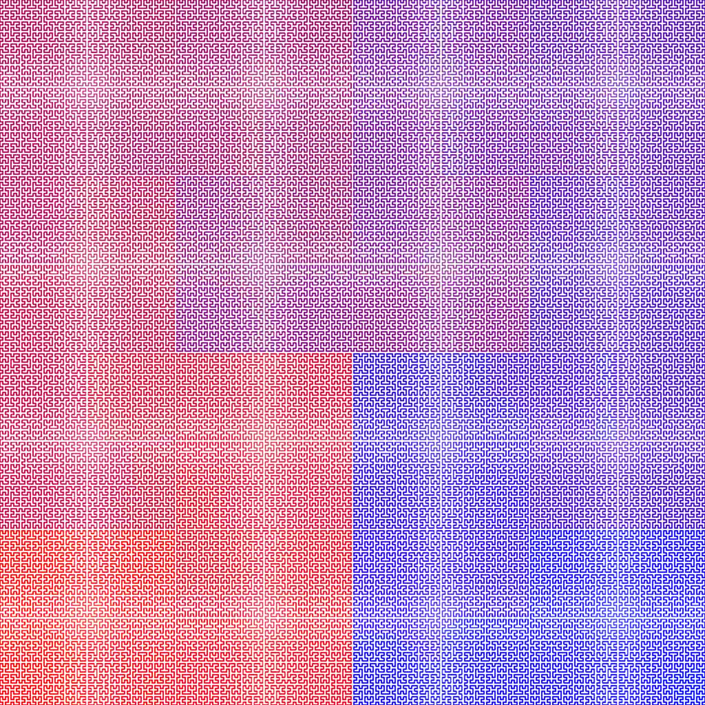
      </a>
      <a href="https://glre.dev/space/hilbert3d">
        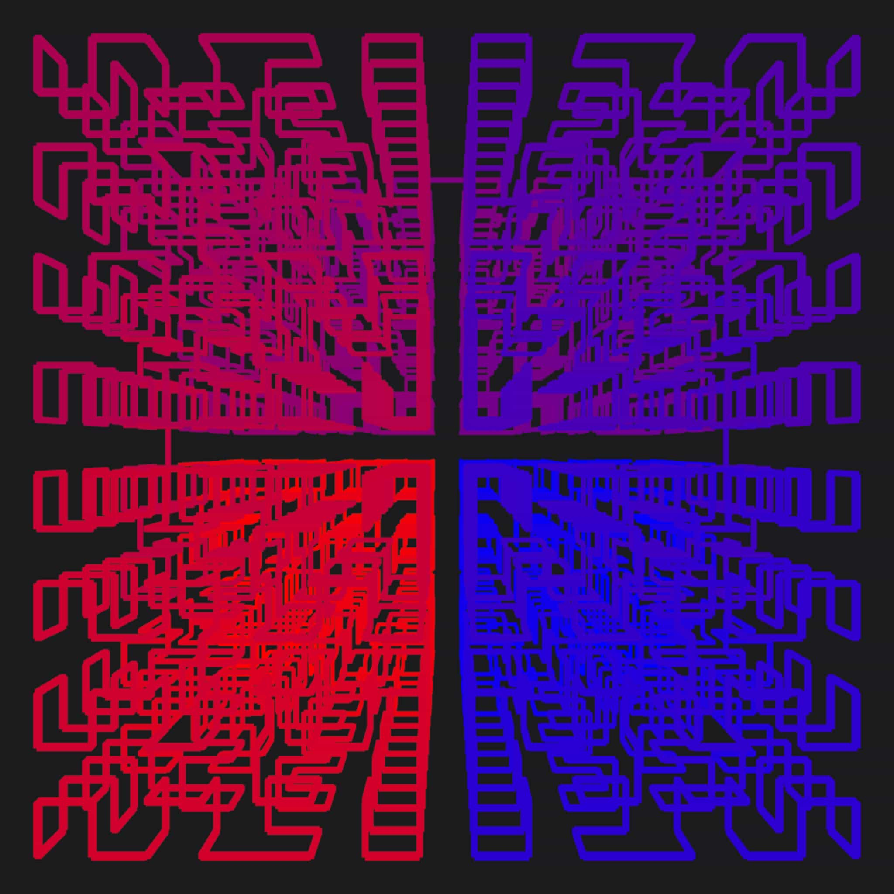
      </a>
    </td>
    <td>
      <h4>morton curve</h4>
      <hr>
      demo:
      <a href="https://glre.dev/space/morton2d">morton2d</a>
      /
      <a href="https://glre.dev/space/morton3d">morton3d</a>
      <a href="https://glre.dev/space/morton2d">
        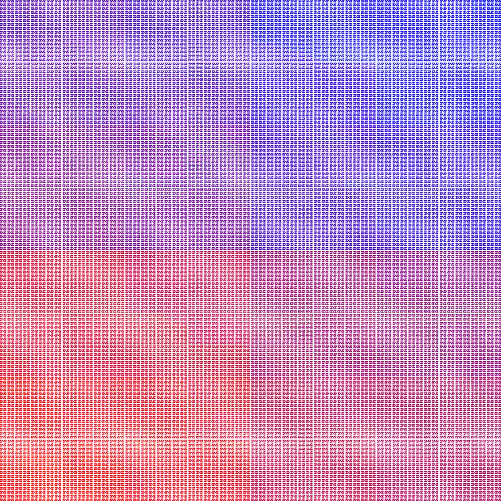
      </a>
      <a href="https://glre.dev/space/morton3d">
        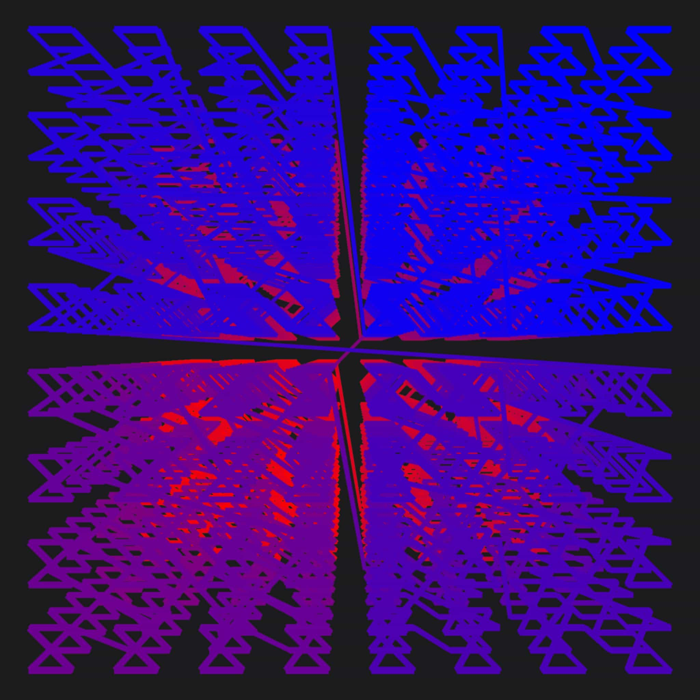
      </a>
    </td>
    <td>
      <h4>original curve</h4>
      <hr>
      demo:
      <a href="https://glre.dev/space/original2d">original2d</a>
      /
      <a href="https://glre.dev/space/original3d">original3d</a>
      <a href="https://glre.dev/space/original2d">
        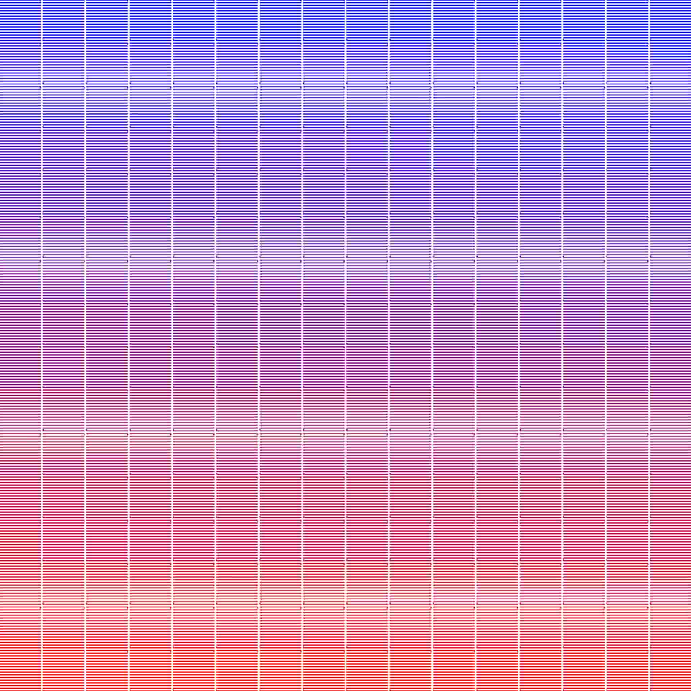
      </a>
      <a href="https://glre.dev/space/original3d">
        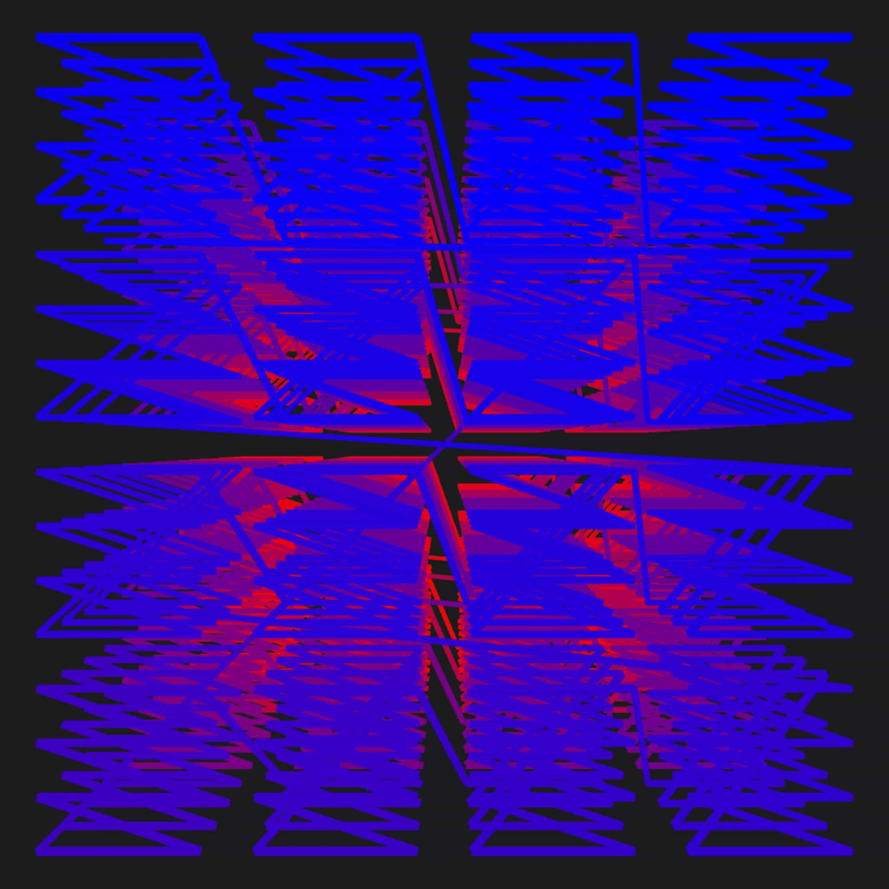
      </a>
    </td>
  </tr>
</table>

### binary greedy meshing （貪欲法）

- demo: [here](https://cloudflare-partyserver-test.tseijp.workers.dev/)

<a href="https://cloudflare-partyserver-test.tseijp.workers.dev/">
  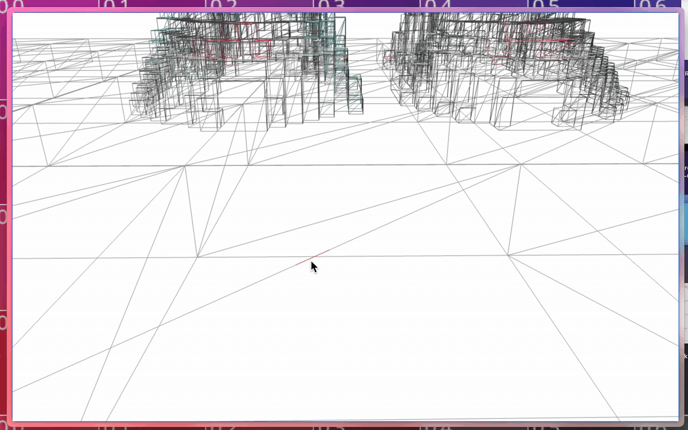
</a>

### multiple program instancing

- demo: [here](https://glre.dev/instance/multiples)

<a href="https://glre.dev/instance/multiples">
  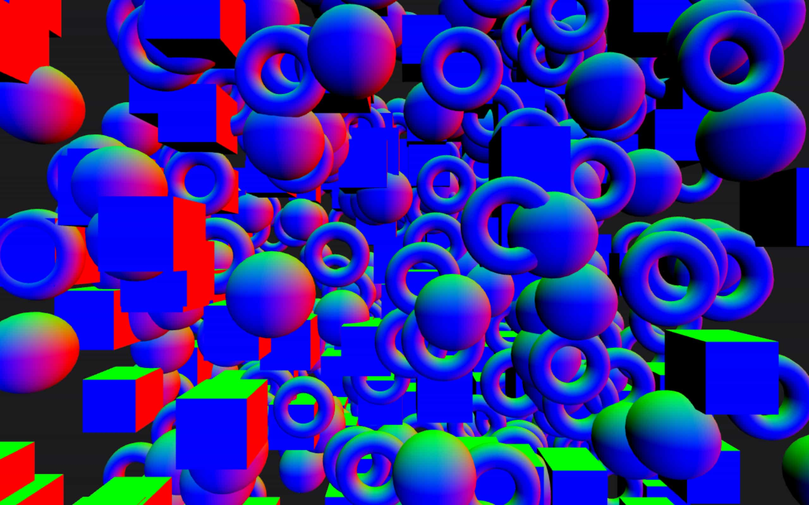
</a>

### priority queue multi threading （web worker）

> - ja: [CLAUDE.ja.md](./CLAUDE.ja.md)
> - en: [CLAUDE.md](./CLAUDE.md)
>
> ```ts
> ┌───────────────────────────────────────────────────────────────────────┐
> │                    Region State Transition Diagram                    │
> ├───────────────────────────────────────────────────────────────────────┤
> │                 tune('image', 1)                                      │
> │      ┌───────────────────────────────────────────────┐                │
> │      │                                               ▼                │
> │ ┌────┴──┐       tune('full', 2)    ┌──────────┐    Worker   ┌───────┐ │
> │ │ none  │ ───────────────────────▶ │ fetching │ ──────────▶ │ image │ │
> │ └───────┘                          └────┬─────┘             └───┬───┘ │
> │      ▲ dispose()                        │ tune('full', 3)       │     │
> │      │                                  ▼                       ▼     │
> │ ┌────┴───┐      tune('none', -1)   ┌──────────┐    Worker   ┌──────┐  │
> │ │ purged │ ◀────────────────────── │ building │ ──────────▶ │ full │  │
> │ └────────┘                         └────┬─────┘             └──────┘  │
> │      ▲                                  │ fail 3x                     │
> │      │ dispose()                        ▼                             │
> │      │                             ┌───────┐                          │
> │      └─────────────────────────────│ error │ ← skip render            │
> │                                    └───────┘                          │
> │ Internal Variables:                                                   │
> │   level   = 'none' | 'image' | 'full' | 'error' ← completion state    │
> │   request = 'none' | 'image' | 'full'  ← current request              │
> │   ticket  = number                     ← request ID (ignore stale)    │
> │   isError = boolean                    ← permanent error flag         │
> │   retry   = number                     ← failures before error        │
> └───────────────────────────────────────────────────────────────────────┘
> ```

### realtime multiple user playing （partyserver）

## Reference

- hierarchical pathfinding
     - [x] [GDC Vault Hierarchical Dynamic Pathfinding for Large Voxel Worlds - YouTube](https://www.youtube.com/watch?v=pG9SoTF1mCI)
     - [x] [Clearance-based Pathfinding and Hierarchical Annotated A\* Search | AiGameDev.com](https://web.archive.org/web/20190411040123/http://aigamedev.com/open/article/clearance-based-pathfinding/)
     - [x] [Hierarchial-Pathfinding-Research | Repository for Hierarchial Pathfinding Research Made by sophomore student of CITM.](https://alexmelenchon.github.io/Hierarchial-Pathfinding-Research/)
     - [x] [hierarchical-pathfinding/Assets/Scripts/HierarchicalPathfinder.cs at master · hugoscurti/hierarchical-pathfinding](https://github.com/hugoscurti/hierarchical-pathfinding/blob/master/Assets/Scripts/HierarchicalPathfinder.cs)
     - [x] [mich101mich/hierarchical_pathfinding: A Rust crate to find Paths on a Grid using HPA* (Hierarchical Pathfinding A*) and Hierarchical Dijkstra](https://github.com/mich101mich/hierarchical_pathfinding)
     - [x] [Hierarchial-Pathfinding-Research/full_code/Motor2D/j1Pathfinding.cpp at master · AlexMelenchon/Hierarchial-Pathfinding-Research](https://github.com/AlexMelenchon/Hierarchial-Pathfinding-Research/blob/master/full_code/Motor2D/j1Pathfinding.cpp)
- occlusion culling
     - [x] [Aokana: オープンワールドゲーム向け GPU 駆動型ボクセル レンダリング フレームワーク](https://arxiv.org/html/2505.02017v1)
     - [x] [ボクセルエンジンを作ろう - 06 - チャンク最適化](https://sites.google.com/site/letsmakeavoxelengine/home/chunk-optimizations?authuser=0)
     - [x] [Procedural World：ボクセルオクルージョン](https://procworld.blogspot.com/2015/08/voxel-occlusion.html)
     - [x] [Occlusion Culling for Chunks? : r/VoxelGameDev](https://www.reddit.com/r/VoxelGameDev/comments/qyqkmm/occlusion_culling_for_chunks/)
- greedy meshing
     - [x] [TanTanDev/binary_greedy_mesher_demo](https://github.com/TanTanDev/binary_greedy_mesher_demo)
     - [x] [cgerikj/binary-greedy-meshing](https://github.com/cgerikj/binary-greedy-meshing)
     - [x] [cfranssens/bad-minecraft: 人気のサンドボックス ゲーム Minecraft の粗悪なクローン。](https://github.com/cfranssens/bad-minecraft)
     - [x] [tim-oster/voxel-rs: Rust と OpenGL で書かれたスパースボクセルオクツリーレイトレーサー](https://github.com/tim-oster/voxel-rs)
- space fill curve
     - [x] [空間充填曲線 - Wikipedia](https://ja.wikipedia.org/wiki/空間充填曲線)
     - [x] [空間充填曲線による空間インデックス #フラクタル図形 - Qiita](https://qiita.com/taichi_itoh/items/09e075fbd68b32d26135)
     - [x] [空間充填曲線の美しさ：ヒルベルト曲線を理解する | Towards Data Science](https://towardsdatascience.com/the-beauty-of-space-filling-curves-understanding-the-hilbert-curve/)
     - [x] [3D ヒルベルト曲線をさらに少ない命令で計算 – threadlocalmutex.com](https://threadlocalmutex.com/?p=178)
     - [x] [アルゴリズム - N 次元値をヒルベルト曲線上の点にマッピングする - Stack Overflow](https://stackoverflow.com/questions/499166/mapping-n-dimensional-value-to-a-point-on-hilbert-curve)
     - [x] [Efficient Deep Space Filling Curve](https://openaccess.thecvf.com/content/ICCV2023/papers/Chen_Efficient_Deep_Space_Filling_Curve_ICCV_2023_paper.pdf)
     - [x] [shadertoy | Inverse Morton and Hilbert](https://www.shadertoy.com/view/XdlcWr)
     - [x] [shadertoy | Hilbert Curve Construction](https://www.shadertoy.com/view/3tl3zl)
     - [x] [shadertoy | Hilbert curve](https://www.shadertoy.com/view/Xl3fzX)
     - [x] [shadertoy | 3D Hilbert Curve](https://www.shadertoy.com/view/tlf3zX)
     - [x] [shadertoy | Z curve](https://www.shadertoy.com/view/7ssBz7)
     - [x] [shadertoy | z-order fail](https://www.shadertoy.com/view/dtsczl)
     - [x] [Z 階数曲線 - Wikipedia](https://ja.wikipedia.org/wiki/Z階数曲線)
- frustum culling
     - [x] [Inigo Quilez :: コンピュータグラフィックス、数学、シェーダー、フラクタル、デモシーンなど](https://iquilezles.org/articles/frustumcorrect/)
     - [x] [インスタンス化された描画 + フラスタムカリング : r/opengl](https://www.reddit.com/r/opengl/comments/13z9gs8/instanced_drawing_frustum_culling/?tl=ja)
     - [x] [LearnOpenGL - フラスタムカリング](https://learnopengl.com/Guest-Articles/2021/Scene/Frustum-Culling)
     - [x] [ボクセルエンジンを作ろう - 09 - フラスタムカリング](https://sites.google.com/site/letsmakeavoxelengine/home/frustum-culling?authuser=0)
- webassembly
     - [x] [nshen/vite-plugin-wasm-pack: 🦀 Vite plugin for rust wasm-pack](https://github.com/nshen/vite-plugin-wasm-pack)
     - [x] [Rust から WebAssembly にコンパイル - WebAssembly | MDN](https://developer.mozilla.org/ja/docs/WebAssembly/Guides/Rust_to_Wasm)
     - [x] [Vite で Rust+WebAssembly 入門 #vite - Qiita](https://qiita.com/tnagata/items/85831ac5c48de7e74d42)
     - [x] [Rust を WebAssembly にコンパイルして Vite で使ってみる](https://zenn.dev/kazuhe/articles/60e431b09aa284)
- hono/auth-js
     - [x] [hono/auth-js を使って Hono/Cloudflare pages で Google 認証する - Kumatora の技術ブログ](https://www.kumatoratiger.com/posts/hono-cloudfflare-pages-auth-js)
     - [x] [hono/auth-js と Cloudflare D1/drizzle で ユーザーのサインアップを実装する - Kumatora の技術ブログ](https://www.kumatoratiger.com/posts/hono-cloudfflare-d1-drizzle-auth-js)
     - [x] [HonoX で Auth.js の CustomPage を使う](https://zenn.dev/nekoya3/articles/5564854fbdffc9)
     - [x] [Auth.js を使って Hono に Google 認証を設定する](https://zenn.dev/hirokisakabe/articles/ede0cad8d88a9f)
     - [x] [@hono/auth-js - npm](https://www.npmjs.com/package/@hono/auth-js)
- texture atlas
     - [x] [unity - 最適化されたボクセルメッシュに異なるブロックタイプをテクスチャリングする - Game Development Stack Exchange](https://gamedev.stackexchange.com/questions/185036/texturing-different-block-types-on-an-optimized-voxel-mesh)
     - [x] [テクスチャアトラス、ラッピング、ミップマッピング – 0 FPS](https://0fps.net/2013/07/09/texture-atlases-wrapping-and-mip-mapping/)
     - [x] [アドバイスが必要です: 貪欲メッシュボクセルモデルに PBR を適用する方法 - ヘルプとサポート - PlayCanvas ディスカッション](https://forum.playcanvas.com/t/need-advice-how-to-apply-pbr-for-greedy-meshed-voxel-models/1542/7)
- z-fighting
     - [x] [Hybrid Multi-Frustum Logarithmic Depth Buffer – Cesium](https://cesium.com/blog/2018/05/24/logarithmic-depth/)
     - [x] [Outerra: Maximizing Depth Buffer Range and Precision](https://outerra.blogspot.com/2012/11/maximizing-depth-buffer-range-and.html)
     - [x] [Outerra: Logarithmic Depth Buffer](https://outerra.blogspot.com/2009/08/logarithmic-z-buffer.html)
     - [x] [Outerra: Logarithmic depth buffer optimizations & fixes](https://outerra.blogspot.com/2013/07/logarithmic-depth-buffer-optimizations.html)
     - [x] [SilverLining と Triton で OpenGL 対数深度バッファを使用する - Sundog Software](https://www.sundog-soft.com/2015/06/using-an-opengl-logarithmic-depth-buffer-in-silverlining-and-triton/)
     - [x] [A Logarithmic Depth Buffer Example. - Sundog Software](https://sundog-soft.com/2015/09/a-logarithmic-depth-buffer-example/)
